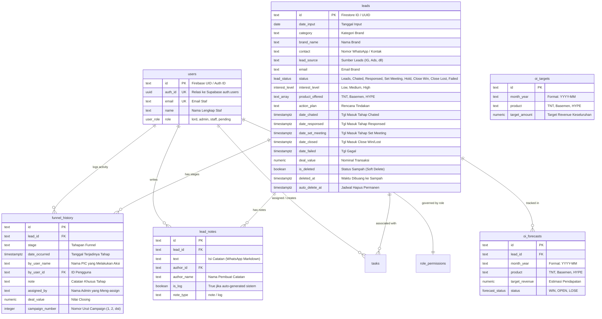

# DOKUMENTASI SISTEM & ARSITEKTUR LENGKAP
## CoreDesk CRM Sales TNT V2 (Next.js + Supabase)

Dokumen ini disusun sebagai peta arsitektur, relasi basis data, interaksi tombol/input, serta panduan efisiensi sistem secara mendalam dan menyeluruh untuk proyek `crm-sales-tnt-v2`.

---

## DAFTAR ISI
1. [Ringkasan Arsitektur Proyek (Dual-Core Architecture)](#1-ringkasan-arsitektur-proyek)
2. [Skema Basis Data & Relasi Data (Supabase PostgreSQL)](#2-skema-basis-data--relasi-data)
3. [Alur Kerja Pengguna (End-to-End User Workflows)](#3-alur-kerja-pengguna)
4. [Katalog Tombol, Modal, dan Sistem Input UI](#4-katalog-tombol-modal-dan-sistem-input-ui)
5. [Hasil Analisis Graphify (God Nodes & Hub Komunitas)](#5-hasil-analisis-graphify)
6. [Audit Masalah, Hal yang Tidak Diperlukan & Optimasi Build/Size](#6-audit-masalah-dan-rekomendasi-efisiensi)

---

## 1. RINGKASAN ARSITEKTUR PROYEK

Proyek ini saat ini berada dalam kondisi **Hybrid/Migrasi**:
- **Aplikasi Aktif (Production):** Terletak di dalam subfolder `next-crm/`. Aplikasi ini dibangun menggunakan **Next.js 16 (App Router)**, **React 19**, **Tailwind CSS v4**, dan terintegrasi dengan **Supabase (PostgreSQL + Auth SSR)**. Folder inilah yang dideploy ke Vercel.
- **Aplikasi Warisan (Legacy):** Terletak di root proyek (`/src`, `/dist`, `package.json`, `vite.config.ts`, `firebase.json`). Ini adalah versi lama yang dibangun dengan **Vite + React + Firebase Firestore/Auth**.
- **Aset Data Migrasi:** Folder `firestore_backup/` (37 file JSON backup data leads lama) dan folder `scripts/` (berisi berbagai script Node.js sekali pakai untuk migrasi data dari Firestore ke Supabase).

### Struktur Direktori Inti `next-crm/`
```
next-crm/
├── src/
│   ├── app/
│   │   ├── layout.tsx             # Root layout: Interceptor Auth & Pendaftaran Otomatis
│   │   ├── page.tsx               # Halaman Dashboard & Leads Pipeline (Server Component)
│   │   ├── login/page.tsx         # Halaman Login Google OAuth
│   │   ├── leads/page.tsx         # Halaman Database Leads Master (6.000+ data)
│   │   ├── lead/[id]/page.tsx     # Halaman Detail Brand, History Funnel, & Notes
│   │   ├── oi_forecast/page.tsx   # Halaman Operational Income & Target Bulanan
│   │   ├── tasks/page.tsx         # Halaman Manajemen Task Global
│   │   ├── permissions/page.tsx   # Matriks Izin Akses Berbasis Role
│   │   ├── admin/
│   │   │   ├── users/page.tsx     # Manajemen User (Approve / Ubah Role Staf)
│   │   │   ├── targets/page.tsx   # Pengaturan Target Revenue Staf & Global
│   │   │   └── approvals/page.tsx # Antrean Approval Permintaan Khusus
│   │   └── actions/               # Next.js Server Actions (Bulk Delete, CSV Batch Import)
│   ├── components/                # Komponen Antarmuka Klien (DashboardClient, LeadsClient, dll)
│   ├── lib/                       # Utility Tailwind Merge (cn)
│   ├── types.ts                   # TypeScript Interfaces & Enums
│   └── utils/supabase/            # Konfigurasi Supabase Client & Server SSR
```

---

## 2. SKEMA BASIS DATA & RELASI DATA (SUPABASE POSTGRESQL)

Basis data menggunakan PostgreSQL yang di-host di Supabase.



### Stored Procedures / Database RPCs (Kinerja Tinggi)
1. **`get_dashboard_stats(p_admin, p_category, p_products, p_start_date, p_end_date)`**:
   - Menghitung agregasi scorecard: Total Leads, Chated, Responsed, Set Meeting, Won, Lost, Failed, Total Revenue secara instan di sisi database tanpa perlu mendownload ribuan data ke browser.
2. **`get_individual_contributions(p_admin, p_category, p_products, p_start_date, p_end_date)`**:
   - Menghitung kontribusi performa masing-masing sales rep (total chat, total meet, closing revenue) dalam rentang tanggal tertentu.
3. **`get_ghosted_leads(p_admin, p_category, p_products)`**:
   - Mendeteksi leads yang belum pernah disentuh atau tidak ada pergerakan status selama $\ge 10$ hari untuk segera difollow-up.

---

## 3. ALUR KERJA PENGGUNA (END-TO-END WORKFLOWS)

### Alur 1: Pendaftaran & Akses Pengguna Baru
1. Pengguna membuka URL aplikasi dan diarahkan ke `/login`.
2. Pengguna menekan tombol **"Login dengan Google"**.
3. Saat autentikasi Google berhasil, `app/layout.tsx` memeriksa apakah user sudah ada di tabel `public.users`:
   - Jika **BELUM ADA**, sistem melakukan **Auto-Registration** otomatis dengan menyimpan `email`, `name` dari Google metadata, dan memberikan role `pending`.
4. Jika role pengguna adalah `pending`:
   - Pengguna dicegat oleh komponen `<PendingScreen />` (menampilkan pesan *"Akun Anda sedang menunggu persetujuan Administrator"* dan tombol Logout).
   - Pengguna sama sekali tidak dapat melihat data leads atau navigasi menu.
5. Administrator membuka menu **"Users"** (muncul tanda badge merah jumlah pending user), lalu menekan tombol biru **"Approve Staff"**.
6. Role pengguna berubah menjadi `staff` dan kini dapat mengakses Dashboard dan leads.

### Alur 2: Input & Pengelolaan Database Leads
1. Pengguna membuka `/leads` (Database Leads).
2. **Tambah Lead Baru:** Klik tombol **"+ Add Lead"**:
   - Sistem memiliki **Pencegah Duplikat Cerdas**: Saat mengetik nama brand, sistem mencari apakah brand serupa sudah ada di database.
   - Jika sudah ada, sistem memunculkan peringatan biru bahwa brand tersebut sudah dikelola oleh staf lain beserta tahapannya.
3. **Impor CSV Massal:**
   - Pengguna mengunggah file CSV melalui modal import.
   - Diproses melalui Server Action `importLeadsBatch` dengan revalidasi cache otomatis.
4. **Soft Delete (Sampah):**
   - Pengguna menekan ikon tong sampah pada baris lead.
   - Field `is_deleted` diubah menjadi `true`, `deleted_at` diisi waktu saat ini, dan `auto_delete_at` diatur 30 hari ke depan.
   - Data otomatis hilang dari tab **ACTIVE** dan berpindah ke tab **SAMPAH**.
5. **Restore & Kosongkan Sampah:**
   - Di tab **SAMPAH**, pengguna bisa menekan tombol **Restore** untuk mengembalikan lead ke tab aktif.
   - Tombol merah **"Kosongkan Sampah"** akan mengeksekusi penghapusan permanen (`.delete()`) data forecast dan data lead dari database server seketika.

### Alur 3: Leads Pipeline (Dashboard) & Manajemen Funnel
1. Pengguna membuka `/` (Dashboard / Leads Pipeline).
2. Filter fleksibel tersedia: Rentang Tanggal (Start - End), PIC/Admin, Status Funnel, Kategori Industri, dan Produk Penawaran.
3. Menampilkan Scorecard ringkasan (Total Leads, Chated, Responsed, Set Meeting, Deals Won, Revenue).
4. Menampilkan tabel **Leads Pipeline** dengan pagination server-side (`.range()`).
5. **Update Status Cepat:**
   - Pengguna dapat mengklik badge status pada tabel untuk membuka `StatusModalClient`.

### Alur 4: Profil Brand, Jejak Funnel & Rich Text Notes
1. Pengguna mengklik nama brand di Pipeline atau Database Leads untuk masuk ke `/lead/[id]`.
2. Di halaman profil:
   - **Tombol Kembali (Back):** Dilengkapi pembersih cache otomatis (`router.refresh()` + `router.back()`) agar data di tabel utama langsung sinkron tanpa perlu refresh manual (F5).
   - **Pencatat Jejak Funnel:** Setiap perubahan status akan memvalidasi kelengkapan tahapan sebelumnya.
   - **Notes Editor Gaya WhatsApp:** Mendukung pengetikan Enter/Baris Baru, Tab identasi, Bold (`*teks*`), Italic (`_teks_`), Strikethrough (`~teks~`), List (`- item`), Numbering (`1. item`), Blockquote (`> teks`), dan Inline Code (`` `teks` ``).
   - **Task Brand:** Staf dapat membuat to-do list tugas follow-up dengan tanggal tenggat waktu.

### Alur 5: Operational Income (OI) Forecast & Repeat Order
1. Pengguna membuka `/oi_forecast`.
2. Menampilkan target bulanan per produk (`TNT`, `Basemen`, `HYPE`).
3. Menampilkan tabel matriks brand yang ditargetkan untuk closing di bulan berjalan.
4. **Closing Brand (Close Win):**
   - Saat mengubah status menjadi **Close Win**, muncul modal `Catat Jejak Funnel`.
   - **Lengkapi Funnel yang Bolong (Retroaktif):** Jika tahapan `Chated`, `Responsed`, atau `Set Meeting` belum pernah diisi, sistem menyediakan input tanggal untuk melengkapi seluruh tahapan secara retroaktif.
   - **Atribusi PIC:** Jejak funnel yang dilengkapi otomatis tercatat atas nama staf yang di-assign (`finalAuthor`), memastikan kredit performa masuk ke staf yang tepat.
   - **Deteksi Campaign Berulang:**
     - Jika brand sudah pernah memiliki "Campaign Ke-1", sistem memunculkan peringatan kuning: *"Brand ini sudah punya Campaign Ke-1. Apakah maksudnya Campaign Ke-2?"*.
     - Pengguna dapat menekan tombol **"Pakai Ke-2 Saja"** untuk menambah baris campaign baru (repeat order), atau menimpa (override) data lama jika berniat merevisi nominal closing sebelumnya.
   - Penghapusan baris di OI Forecast hanya menghapus baris pemantauan target di tabel `oi_forecasts`, sedangkan data brand dan jejak funnel di database utama **tetap aman**.

---

## 4. KATALOG TOMBOL, MODAL, DAN SISTEM INPUT UI

| Lokasi / Halaman | Komponen / Tombol | Aksi & Logika Sistem |
| :--- | :--- | :--- |
| **Global Layout** | `<PendingScreen />` Logout | Menjalankan `supabase.auth.signOut()`, redirect ke `/login` & purge router cache. |
| **Sidebar** | Badge Merah "Users" | Menghitung otomatis jumlah `users` berstatus `role = 'pending'`. |
| **Leads Pipeline (`/`)** | Filter PIC / Admin | Memicu query RPC `get_dashboard_stats` dan filter inner join `filtered.by_user_name`. |
| **Leads Pipeline (`/`)** | Date Range Picker | Menentukan jendela waktu evaluasi performa funnel (`p_start_date` s/d `p_end_date`). |
| **Database Leads (`/leads`)** | Tab ACTIVE / SAMPAH | Mengubah filter memori `l.isDeleted === false` (Active) atau `=== true` (Sampah). |
| **Database Leads (`/leads`)** | Tombol "+ Add Lead" | Membuka `LeadModalClient` dengan validasi duplikasi brand real-time. |
| **Database Leads (`/leads`)** | Tombol "Kosongkan Sampah" | Menghapus tuntas data berstatus `is_deleted = true` secara cascading dari tabel server. |
| **Database Leads (`/leads`)** | Bulk Checkbox & Delete | Memilih beberapa baris sekaligus untuk dipindahkan ke tempat sampah secara massal. |
| **Detail Brand (`/lead/[id]`)** | Panah Kembali (Kiri Atas) | Memanggil `router.refresh()` diikuti `router.back()` untuk memaksa tabel luar re-fetch data terbaru. |
| **Detail Brand (`/lead/[id]`)** | Toolbar WhatsApp Editor | Menyisipkan format markdown: Bold (`**`), Italic (`*`), Strikethrough (`~~`), List, Quote. |
| **OI Forecast (`/oi_forecast`)** | Tab Produk (TNT/Basemen/HYPE) | Memisahkan view forecast dan summary KPI berdasarkan lini produk. |
| **Status Modal** | Tombol "Terapkan" | Memperbarui tabel `leads`, menyisipkan baris `funnel_history`, mencatat `lead_notes`, lalu `router.refresh()`. |
| **Status Modal** | Tombol "Pakai Ke-(N+1) Saja" | Mengubah input `campaignNumber` menjadi increment angka berikutnya untuk repeat order. |
| **Admin Users (`/admin/users`)** | Tombol "Approve Staff" | Mengubah role user dari `pending` menjadi `staff` seketika. |

---

## 5. HASIL ANALISIS GRAPHIFY

Ekstraksi kode menghasilkan graf pengetahuan dengan **1.040 node** dan **1.620 edge** yang terbagi dalam **111 komunitas arsitektur**.

### 5 God Nodes Terbesar (Pusat Ketergantungan Kode)
1. **`createClient()`** (39 edges): Instance Supabase Client yang diinjeksi ke seluruh komponen klien untuk komunikasi database.
2. **`cn()`** (35 edges): Helper utility penggabung class Tailwind (`clsx` + `tailwind-merge`).
3. **`UserProfile`** (34 edges): Type interface definisi data identitas pengguna dan otorisasi role.
4. **`Lead`** (26 edges): Type interface model data utama entitas prospek sales.
5. **`DashboardClient` / `LeadsClient`**: Komponen orkestrator antarmuka pengguna terbesar.

### Koneksi Kunci Antar Modul
- `PendingScreen` $\to$ `createClient()`: Menangani sesi logout langsung dari auth client.
- `layout.tsx` $\to$ `users`: Bertindak sebagai middleware/gatekeeper server-side sebelum halaman manapun dirender.
- `DashboardClient` $\to$ `get_dashboard_stats`: Mengalihkan komputasi analitik berat langsung ke PostgreSQL engine.

---

## 6. AUDIT MASALAH DAN REKOMENDASI EFISIENSI BUILD & UKURAN

Berikut adalah temuan konkret penyebab repo berukuran besar (**1.2+ GB**) dan solusi optimasinya:

### 1. Dual `node_modules` & Kode Legacy (Menyita ~850 MB)
- **Kondisi Saat Ini:** 
  - Root proyek memiliki `node_modules/` lama sebesar **380 MB** (berisi dependency Vite, Express, Firebase v12).
  - Folder `next-crm/` memiliki `node_modules/` aktif sebesar **476 MB**.
  - Folder `dist/` (1.4 MB), folder `src/` lama (0.5 MB), dan `jangan di apa apain/` masih tersimpan di root padahal tidak digunakan lagi oleh Next.js.
- **Rekomendasi Pembersihan:**
  - Hapus folder `node_modules/` di root proyek (bukan yang di dalam `next-crm/`).
  - Hapus folder `dist/` di root.
  - Arsipkan atau hapus folder `src/` legacy di root setelah memastikan semua fungsi sudah berpindah ke `next-crm/src/`.

### 2. File Sampah & Backup Database di Repositori Git (Menyita ~15 MB)
- **Kondisi Saat Ini:**
  - Folder `firestore_backup/` berisi 37 file JSON mentah (~10 MB). File ini tidak diperlukan untuk runtime Next.js.
  - Gambar tangkapan layar `ChatGPT Image Aug 15, 2026...png` (1.73 MB) tersimpan di root.
  - File-file teks dump sementara di `next-crm/`: `old_leads_client.txt` (118 KB), `old_dashboard.txt` (14 KB), `grep_chated.txt` (6 KB), `test_dash.js`, `test_lead.js`, `test_map.js`.
- **Rekomendasi:**
  - Tambahkan `firestore_backup/`, `*.png`, `old_*.txt` ke dalam `.gitignore`.
  - Hapus file dump teks dan script scratch yang tidak terpakai dari folder production `next-crm/`.

### 3. Optimasi Ukuran Bundle & Kecepatan Build Next.js
- **Kondisi Saat Ini:**
  - Di `next-crm/package.json`, paket `@types/papaparse` ditaruh di `dependencies` (seharusnya di `devDependencies`).
  - Next.js memuat 6.000+ data lead sekaligus di `app/leads/page.tsx` via loop `while(hasMore)`. Ini mentransfer data payload sebesar **3-5 MB** setiap kali user membuka `/leads`.
- **Rekomendasi Kinerja:**
  - Ubah `app/leads/page.tsx` agar menggunakan **Server-Side Pagination** (seperti yang sudah berhasil diterapkan di `DashboardClient` dengan query `.range(from, to)`), sehingga setiap navigasi hanya memuat 50 data lead (payload < 50 KB, rendering 10x lebih cepat).
  - Pindahkan type definitions ke `devDependencies`.

### 4. Kebersihan Kredensial & Keamanan
- File kredensial lama seperti `firebase-key.json`, `crm-sales-nova-client_secret...json` masih ada di root. Pastikan tidak ada credential sensitif yang terunggah ke repositori publik.

---
*Dokumentasi ini otomatis disinkronkan dengan Graphify Knowledge Graph (`graphify-out/graph.json`). Untuk query arsitektur lebih lanjut melalui terminal, gunakan `graphify query "<pertanyaan>" atau inspect graphify-out/GRAPH_REPORT.md.*
